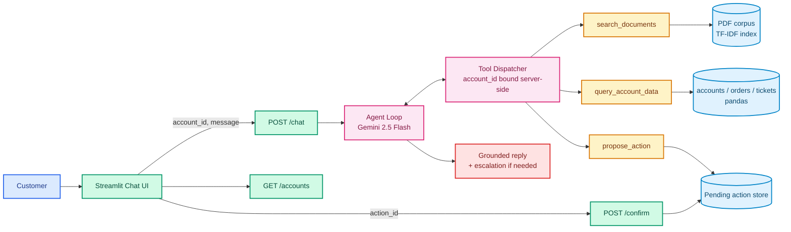
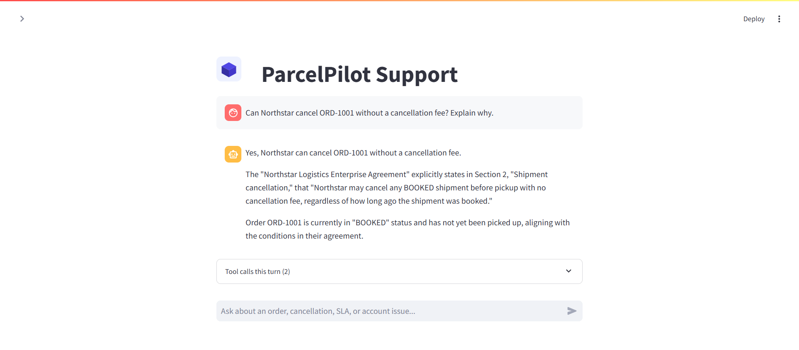
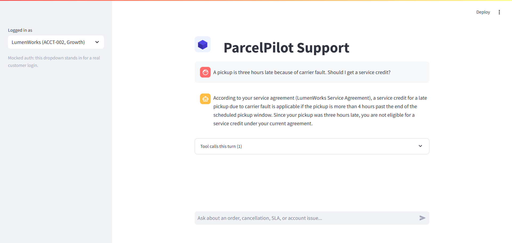

<div align="center">


# ParcelPilot Support Agent

**Account-Scoped Support Chatbot for a B2B Logistics Platform**

[](https://python.org)
[](https://fastapi.tiangolo.com)
[](https://ai.google.dev)
[](https://streamlit.io)
[](https://pandas.pydata.org)
[](https://pytest.org)


*A single tool-calling agent answers customer questions by reasoning over policy documents, signed contracts, and live account data — scoped so a customer can only ever see their own account, and gated so no action fires without confirmation.*

**[Live app →](https://parcelpilot-support-agent-aibyaman.streamlit.app)**

</div>

---

## What It Does

A customer asks: **"Can Northstar cancel ORD-1001 without a cancellation fee? Explain why."**

The agent looks up the order, identifies the account, retrieves the customer's signed agreement, checks it against the general cancellation policy, resolves the override, and answers — citing the exact clause. The same loop handles SLA-breach detection, service-credit calculation, and knowing when to stop and escalate instead of guessing.

---

## Architecture



`propose_action` only stages a proposal; `execute_action` is reachable exclusively from `POST /confirm`, never from the agent's tool schema, so an action cannot fire without explicit user confirmation. `account_id` is resolved server-side from the session and injected into every tool call rather than read from model output, so access control does not depend on the model behaving correctly. Full rationale and trade-offs: [`docs/ARCHITECTURE.md`](docs/ARCHITECTURE.md).

---

<div align="center">

## Tools

| Tool | Type | Responsibility |
|:---:|:---:|:---|
| `search_documents` | Retrieval | TF-IDF search over active policy, SOP, and contract PDFs — never the deprecated policy, never another account's agreement |
| `query_account_data` | Structured lookup / calculation | Account-scoped orders, tickets, and elapsed-time arithmetic against the fixed dataset snapshot time |
| `propose_action` | State-changing (confirmation-gated) | Stages an escalation, ticket update, or follow-up task; requires a separate confirmed call to execute |

</div>

---

<div align="center">

## Tech Stack

| Layer | Choice | Why |
|:---:|:---|:---|
| **LLM** | Gemini 2.5 Flash (`google-genai`) | Native function calling, low cost |
| **Backend** | FastAPI + Uvicorn | Thin, typed, async-capable API layer |
| **Structured data** | pandas over the source xlsx | A handful of rows per sheet; no database needed |
| **Document retrieval** | scikit-learn TF-IDF + cosine similarity | Corpus is 5 single-page PDFs; no vector store needed |
| **PDF parsing** | pypdf | Pure Python, no native dependencies |
| **Frontend** | Streamlit | Chat UI with a per-turn tool-call trace |
| **Tests** | pytest | Access control, confirmation gate, live trap-question suite |

</div>

---

## Setup

Requires Python 3.11+ and a Gemini API key ([Google AI Studio](https://aistudio.google.com/apikey)).

```bash
python -m venv .venv
source .venv/bin/activate        # Windows: .venv\Scripts\activate

pip install -r backend/requirements.txt -r frontend/requirements.txt

cp .env.example .env             # fill in GEMINI_API_KEY
```

Place the candidate data pack (6 PDFs + `ParcelPilot_Assessment_Data.xlsx`) in `data/raw/` if not already present. The app reads directly from those files at startup; nothing is pre-processed into the repo.

**Environment variables** (`.env`):

| Variable | Default | Purpose |
|---|---|---|
| `GEMINI_API_KEY` | — | Required. Gemini API key |
| `PARCELPILOT_MODEL` | `gemini-2.5-flash` | Model used by the agent loop |
| `PARCELPILOT_API_URL` | `http://localhost:8000` | Backend URL the frontend calls |

## Running

Two processes, separate terminals, from the repo root:

```bash
# backend
cd backend
uvicorn app.main:app --reload --port 8000

# frontend
cd frontend
streamlit run app.py
```

Open the Streamlit URL (default `http://localhost:8501`). The sidebar dropdown switches which customer account the session is scoped to.

## API Reference

| Method | Path | Body | Description |
|---|---|---|---|
| `GET` | `/accounts` | — | List accounts for the UI's account switcher |
| `POST` | `/chat` | `{account_id, message}` | Run one agent turn; returns `reply`, `trace`, `pending_actions` |
| `POST` | `/confirm` | `{action_id}` | Execute a previously proposed action |

## Testing

```bash
cd backend
pytest
```

- `test_access_control.py` — a session scoped to one account can never read another account's orders, tickets, or signed agreement; the server ignores any `account_id` a tool call tries to smuggle
- `test_access_control_ablation.py` — an **ablation**, not an assertion: a naive dispatcher built only for comparison (trusts a model-supplied `account_id`) leaks in every cross-account attempt; the real one leaks in none, over the same battery
- `test_confirmation_flow.py` — an action never executes without a prior proposal and explicit confirmation, and cannot be replayed
- `test_agent_error_handling.py` — a malformed tool argument fails the tool call without crashing the request
- `test_trap_questions.py` — six adversarial cases targeting known trust-and-reliability failure modes (stale documents, contract overrides, low-trust historical data, out-of-scope requests, cross-account access, trajectory/groundedness); requires `GEMINI_API_KEY`, skipped otherwise

**Reliability sweep** (pass^k — does the agent get each trap case right k times running, not just once):

```bash
python -m eval.reliability --k 3
```

Results: [`docs/PRODUCT_NOTE.md`](docs/PRODUCT_NOTE.md).

## Project Structure

```text
backend/app/
  config.py     paths, model name, fixed dataset "now", document allow-list
  db.py         accounts/orders/tickets lookup, account-scoped
  documents.py  TF-IDF search over the active (non-deprecated) PDFs
  actions.py    propose_action / execute_action, the confirmation gate
  tools.py      Gemini tool schemas and dispatcher
  agent.py      tool-calling loop and system prompt
  main.py       FastAPI app: /accounts, /chat, /confirm
backend/tests/  access-control, ablation, confirmation-flow, error-handling, trap-question tests
backend/eval/   shared trap cases + the pass^k reliability runner
frontend/app.py Streamlit chat UI
assets/         logo and demo screenshots
docs/           architecture note, product note, AI-tool-usage note
```

## Demo

<div align="center">



*A multi-step query — order lookup, agreement retrieval, policy comparison — answered with a cited source and an expandable tool-call trace.*

<br><br>



*A source-hierarchy example — LumenWorks' contract overrides the general SOP's failed-pickup threshold, so a 3-hour delay correctly comes back not eligible under their specific 4-hour terms.*

</div>

## Scope and Limitations

Stated plainly, because a README that hides its edges isn't evidence of anything.

- **Auth is mocked.** The account switcher stands in for a real customer login — explicitly allowed by the brief. Access control itself is real and tested; only the identity check in front of it is a stand-in.
- **Action execution is mocked.** `propose_action` / `execute_action` write to an in-memory store, not a real ticketing system. The confirmation gate (never execute without an explicit confirm) is the part that matters and is tested; the backend it eventually points at is not.
- **The dataset's "now" is pinned**, not read from the wall clock — the workbook was snapshotted at `2026-08-16 11:00 Asia/Kolkata`, and every elapsed-time calculation is computed against that fixed instant. A real deployment would need this to track actual time.
- **The trap suite is six hand-written cases**, not a large or adversarially-generated eval. pass^3 = 1.000 means every case held up three times running against the specific failure modes it targets — it is not a claim of general robustness.
- **No entity linking between tickets and orders.** A ticket referencing an order does so only in free text; the agent infers the connection from context on every query rather than following a foreign key.
- **Single-account-at-a-time sessions.** The backend keeps one in-memory conversation per account_id, sized for a demo, not concurrent multi-user production traffic.
- **Free-tier hosting.** The backend (Render free tier) spins down after 15 minutes idle — the first request after a period of inactivity can take 30-60 seconds to wake it up. Expected on a free deployment, not a bug.

## Status

Deployed: frontend on Streamlit Community Cloud, backend on Render. See [`docs/PRODUCT_NOTE.md`](docs/PRODUCT_NOTE.md) for what was intentionally left out of this submission and what would be built next.
