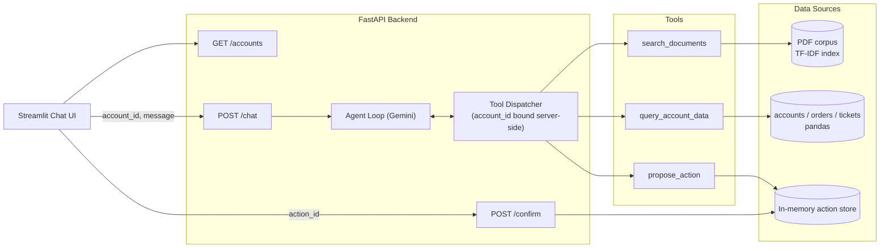

# ParcelPilot Support Agent

A customer-facing support chatbot for ParcelPilot, a B2B logistics platform. A single tool-calling Gemini agent answers questions about entitlements, cancellations, SLAs, and service credits by reasoning over policy documents, signed customer agreements, and structured account/order/ticket data, scoped so a customer can only ever see their own account's data.

Architecture, product, and AI-tool-usage notes: [`docs/`](docs/).

## Architecture



`propose_action` only stages a proposal; `execute_action` is reachable exclusively from `POST /confirm`, never from the agent's tool schema, so an action cannot fire without an explicit user confirmation. `account_id` is resolved server-side from the session and injected into every tool call, not read from model output, so access control does not depend on the model behaving correctly. See [`docs/ARCHITECTURE.md`](docs/ARCHITECTURE.md) for the full design rationale and trade-offs.

## Tech stack

| Layer | Choice | Why |
|---|---|---|
| LLM | Gemini 2.5 Flash (`google-genai`) | Native function calling, low cost |
| Backend | FastAPI + Uvicorn | Thin, typed, async-capable API layer |
| Structured data | pandas over the source xlsx | Dataset is a handful of rows per sheet; no database needed |
| Document retrieval | scikit-learn TF-IDF + cosine similarity | Corpus is 5 single-page PDFs; no vector store needed |
| PDF parsing | pypdf | Pure Python, no native deps |
| Frontend | Streamlit | Chat UI with per-turn tool-call trace |
| Tests | pytest | Access control, confirmation gate, live trap-question suite |

## Prerequisites

- Python 3.11+
- A Gemini API key ([Google AI Studio](https://aistudio.google.com/apikey))

## Setup

```bash
python -m venv .venv
source .venv/bin/activate        # Windows: .venv\Scripts\activate

pip install -r backend/requirements.txt -r frontend/requirements.txt

cp .env.example .env             # fill in GEMINI_API_KEY
```

Place the candidate data pack (6 PDFs + `ParcelPilot_Assessment_Data.xlsx`) in `data/raw/` if not already present. The app reads directly from those files at startup; nothing is pre-processed into the repo.

## Configuration

Environment variables, set in `.env`:

| Variable | Default | Purpose |
|---|---|---|
| `GEMINI_API_KEY` | — | Required. Gemini API key |
| `PARCELPILOT_MODEL` | `gemini-2.5-flash` | Model used by the agent loop |
| `PARCELPILOT_API_URL` | `http://localhost:8000` | Backend URL the frontend calls |

## Running

Two processes, separate terminals, from the repo root:

```bash
# backend
cd backend
uvicorn app.main:app --reload --port 8000

# frontend
cd frontend
streamlit run app.py
```

Open the Streamlit URL (default `http://localhost:8501`). The sidebar dropdown switches which customer account the session is scoped to.

## API reference

| Method | Path | Body | Description |
|---|---|---|---|
| `GET` | `/accounts` | — | List accounts for the UI's account switcher |
| `POST` | `/chat` | `{account_id, message}` | Run one agent turn; returns `reply`, `trace`, `pending_actions` |
| `POST` | `/confirm` | `{action_id}` | Execute a previously proposed action |

## Testing

```bash
cd backend
pytest
```

- `test_access_control.py` — a session scoped to one account can never read another account's orders, tickets, or signed agreement; server ignores any `account_id` a tool call tries to smuggle
- `test_confirmation_flow.py` — an action never executes without a prior proposal and explicit confirmation, and cannot be replayed
- `test_trap_questions.py` — five adversarial questions targeting known trust-and-reliability failure modes (stale documents, contract overrides, low-trust historical data, out-of-scope requests, cross-account access); requires `GEMINI_API_KEY`, skipped otherwise

Results: [`docs/PRODUCT_NOTE.md`](docs/PRODUCT_NOTE.md).

## Project structure

```text
backend/app/
  config.py     paths, model name, fixed dataset "now", document allow-list
  db.py         accounts/orders/tickets lookup, account-scoped
  documents.py  TF-IDF search over the active (non-deprecated) PDFs
  actions.py    propose_action / execute_action, the confirmation gate
  tools.py      Gemini tool schemas and dispatcher
  agent.py      tool-calling loop and system prompt
  main.py       FastAPI app: /accounts, /chat, /confirm
backend/tests/  access-control, confirmation-flow, trap-question tests
frontend/app.py Streamlit chat UI
assets/         project logo
docs/           architecture note, product note, AI-tool-usage note
```

## Status

Runs locally end to end; not yet deployed to a public host. See [`docs/PRODUCT_NOTE.md`](docs/PRODUCT_NOTE.md) for what was intentionally left out of this submission and what would be built next.
